# IoT Sensor Ingestion Service: Observability report

Enterprise Software Development, Fall 2026, Assignment 1. Individual submission by Muhammad Affan.

- **Code and config:** everything is in this repository.
- **Start, use, test and clean up:** [README.md](README.md).
- **Learning guide:** [WALKTHROUGH.md](WALKTHROUGH.md) explains the concepts, follows the code, gives exercises, and shows how to read the dashboards.
- **Raw evidence:** every command and output behind the numbers below is in [docs/BUILD_LOG.md](docs/BUILD_LOG.md).

---

## A. Project

**Problem.** Warehouses, server rooms and labs monitor temperature and humidity with dozens of battery-powered sensors. Nobody watches the raw feed, so an overheating room, a dying battery, a silent sensor or a device sending garbage is found late, for example after stock has spoiled.

**Users.**
- Facilities staff, who need fleet status and alarms.
- Firmware integrators, who send readings and need clear rejection reasons.
- The engineer running the service, who needs metrics and logs (Parts B–E).

**Solution.** A FastAPI service (`api`, port 8000) with SQLite on a Docker volume. `POST /readings` handles each reading in one of three ways:

| Reading | Response | Stored? |
|---|---|---|
| Outside the sensor's **physical** limits (humidity > 100 %, missing field, bad `device_id`, timestamp without a timezone or in the future) | `422` | No |
| Inside the physical limits but outside the **expected** range (10–35 °C, 20–80 %RH, battery ≥ 15 %) | `201`, with reason codes such as `temperature_high` | Yes, flagged as an anomaly |
| Everything in range | `201` | Yes |

Each device's status (`ok`, `anomaly`, or `stale` after 30 s of silence) is computed when it's asked for.

| Routes | Purpose |
|---|---|
| `GET /devices[?status=]` · `GET /devices/{id}` · `GET /devices/{id}/readings` · `GET /anomalies` | Fleet status, one device, its history, fleet-wide alarms |
| `GET/PUT/DELETE /admin/faults` | Deterministic fault injection for Part E: a delay or a 500 on every Nth `POST /readings` |
| `GET /health` · `GET /metrics` · `GET /` | DB health check, Prometheus metrics, operator dashboard |

A **simulator** service sends readings from 20 devices, one every 5 s each (about 4/s). The last four misbehave on purpose, so every code path gets steady traffic:

| Device | Behaviour |
|---|---|
| dev-017 | overheats in cycles |
| dev-018 | battery drains to 1 % |
| dev-019 | 30 % of its readings are invalid |
| dev-020 | offline for 60 s out of every 120 s |

Every request carries an `X-Request-ID`, and every event is written as one JSON log line.

**What works.** Checked from a clean start:
- All 20 devices register.
- dev-017 and dev-018 are flagged with the right reasons.
- dev-019's bad readings are rejected and never stored (12 of 713 in 3 min).
- dev-020 turns `stale` about 30 s after it goes silent.
- Data survives restarts.
- 83 tests pass.

A hands-on guide to the app and its API is in [WALKTHROUGH.md § A4](WALKTHROUGH.md#a4-use-it-yourself). Known limits: single-node SQLite, no authentication (including `/admin/faults`), and fixed thresholds only.

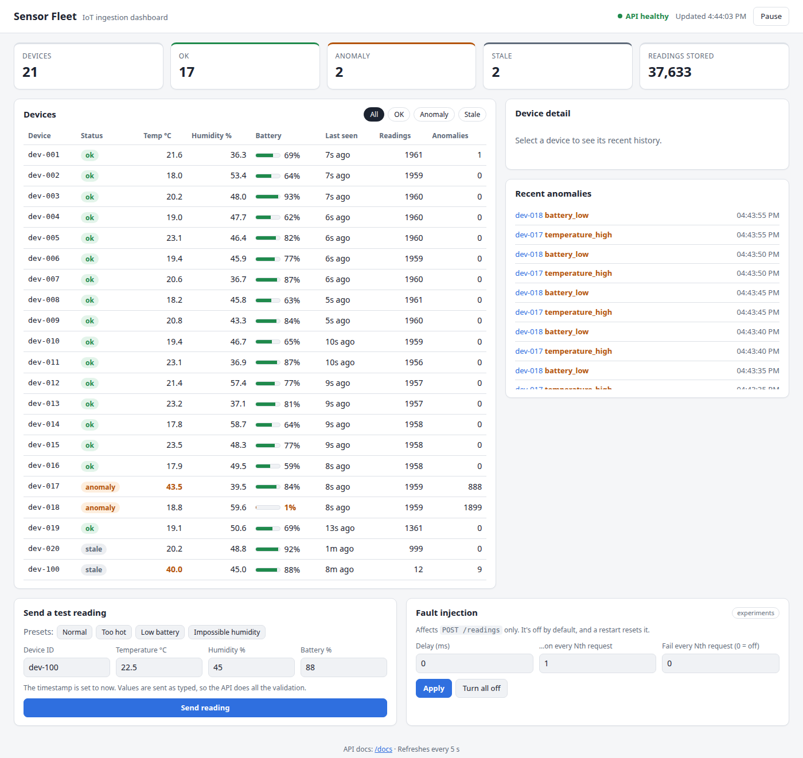

*The operator dashboard, which is what facilities staff use:*
- 21 devices: 17 ok, 2 anomaly and 2 stale.
- dev-017 is highlighted at 43.5 °C during an overheat cycle.
- dev-018's battery is at 1 %.
- dev-020 has been silent for 1 minute (dropout).
- The *Recent anomalies* feed alternates between dev-018 `battery_low` and dev-017 `temperature_high`, every 5 s.
- The two forms send test readings and switch fault injection on and off.

**How to try it.**
1. Run `docker compose up -d --build`.
2. Open the dashboard at http://localhost:8000, the API docs at `/docs`, Grafana at http://localhost:3000 (no login needed) and Prometheus at http://localhost:9090.
3. The simulator fills everything within about a minute.

---

## B. Metrics

### B.1 Setup

- **The app** uses `prometheus_client` 0.26. Every metric is defined in `app/metrics.py` and served at `GET /metrics`. HTTP metrics are recorded in the request middleware, and business metrics at the line where each event happens. It runs as a single process, so no multiprocess mode is needed.
- **Prometheus** (`v3.15.0`, port 9090):
  - It scrapes `api:8000`, Node Exporter and itself **every 5 s**.
  - Data is kept for 7 days in the `prometheus-data` volume.
  - It pulls metrics, so the app never depends on Prometheus. If Prometheus is down, there's just a gap in the graphs.
- **Grafana** (`13.2.2`, port 3000) is **provisioned from files**, with no manual clicking:
  - The datasource (uid `prometheus`) and two dashboards (`monitoring/grafana/dashboards/*.json`) load automatically.
  - To prove it, I deleted Grafana *and* its volume, and both dashboards came back identical.

**Labels come only from small, fixed sets:**
- `route` is the route template (`/devices/{device_id}`), never the real path.
- `outcome`, `reason`, `field` and `status` each have 3–6 values.
- `device_id` and `request_id` are never labels; they belong in logs.

The app exposes about **200–275 series**, and the number grows only when a *new* label combination appears. The latency histogram costs 16 series (15 buckets plus `+Inf`) for every method-and-route pair that has been hit: 11 pairs × 16 = 176 of the 255 series counted on 2026-09-26. Sending one `DELETE /devices` (a new pair) added 19 series; a second identical request added none.

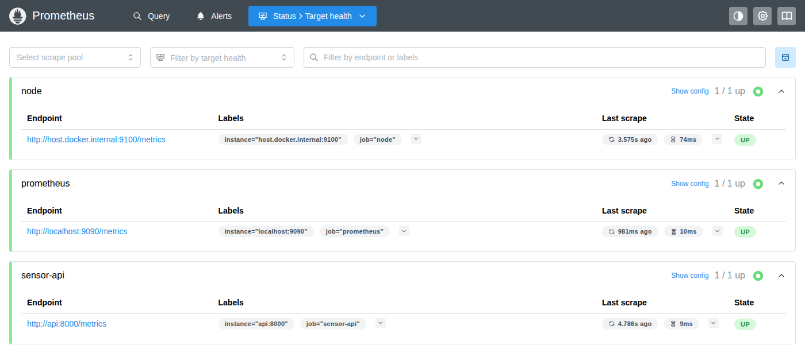

*All three scrape targets are `UP`. Each scrape takes 9–74 ms, well under the 4 s timeout. `node` is reached through the Docker host gateway because Node Exporter runs on the host network (B.6).*

### B.2 Metric table

All Grafana queries use a sliding 1-minute window (`[1m]`). The panels are on the **Sensor Ingestion Service** dashboard (`monitoring/grafana/dashboards/sensor-service.json`).

| Metric | Type | Unit | Labels | Purpose | Where and how it's recorded | Grafana query (panel) | What the chart shows |
|---|---|---|---|---|---|---|---|
| `sensor_http_requests_total` | Counter | requests | `method`, `route`, `status_code` | Traffic and errors per endpoint | `app/middleware.py`, after every response: `HTTP_REQUESTS.labels(method, route, status).inc()` | `sum by (route) (rate(sensor_http_requests_total[1m]))` (*Request rate by route*) | Requests/s per endpoint. `/readings` runs at about 4/s, and the dashboard's polling routes at about 0.2/s each |
| `sensor_http_request_duration_seconds` | **Histogram** (15 buckets, 5 ms … 5 s) | seconds | `method`, `route` | Latency per endpoint, and the source of percentiles | `app/middleware.py`: `HTTP_DURATION.labels(method, route).observe(perf_counter() - start)` | `histogram_quantile(0.95, sum by (le) (rate(sensor_http_request_duration_seconds_bucket{route="/readings",method="POST"}[1m])))`, plus 0.5 and 0.99 (*Latency percentiles*) | p50/p95/p99 of `POST /readings`, about 16 / 20 / 24 ms (Fig. B2) |
| `sensor_http_requests_in_progress` | **Gauge** | requests | none | Concurrency | `app/middleware.py`: `.inc()` when a request arrives, `.dec()` in `finally` | `sensor_http_requests_in_progress` (*Requests in flight*) | Flat at 1, the scrape itself. It would rise if requests piled up |
| `sensor_readings_total` | Counter | readings | `outcome` = normal, anomaly, rejected, failed | **Business:** what happens to every reading sent in | `app/main.py`: `normal`/`anomaly` after `insert_reading()`, `failed` when a fault or DB error stops the handler, `rejected` in the validation handler | `sum by (outcome) (rate(sensor_readings_total[1m]))` (*Readings by outcome*, stacked) | About 3.9 readings/s, almost all stored; the anomaly band moves between 0.2 and 0.4/s (Fig. B3) |
| `sensor_reading_validation_errors_total` | Counter | field failures | `field` (5 fields or `body`), `reason` (Pydantic error type) | **Business / data quality:** *why* readings are rejected | `app/main.py` validation handler, one `.inc()` per failing field | `sum by (field, reason) (increase(sensor_reading_validation_errors_total[1m]))` (*Validation errors per minute by field*) | dev-019's three kinds of bad data, about 1/min each (Fig. B6) |
| `sensor_anomalies_total` | Counter | anomaly reasons | `reason` (5 codes) | **Business:** which alarms are firing | `app/main.py`, one `.inc()` per reason on each stored reading | `sum by (reason) (increase(sensor_anomalies_total[1m]))` (*Anomalies per minute by reason*) | `battery_low` flat at 12/min; `temperature_high` in waves (Fig. B5) |
| `sensor_devices` | **Gauge** (custom collector) | devices | `status` = ok, anomaly, stale | **Business:** fleet health right now | `app/metrics.py` `DeviceStatusCollector.collect()`: at every scrape it reads the `devices` table and applies `compute_status()`, the same rule as `GET /devices` | `sensor_devices` (*Devices by status*, as a stat and a stacked series) | 18 ok, 2 anomaly and 1 stale, with regular notches from dev-020 (Fig. B4) |
| `sensor_db_write_duration_seconds` | **Summary** | seconds | none | Time to store one reading in SQLite | `app/main.py`: `with DB_WRITE.time(): db.insert_reading(...)` | `rate(sensor_db_write_duration_seconds_sum[1m]) / rate(sensor_db_write_duration_seconds_count[1m])` (*DB write time (average)*) | A mean of about 8 ms, which is half of the 16 ms p50 request. Python summaries have no quantiles, so this is a mean |
| `sensor_fault_active` | Gauge | 0/1 | `fault` = delay, error | Shows when a fault experiment is on | `app/faults.py` `FaultState._publish()`, on every config change | `sensor_fault_active` (*Fault injection* stat, *Fault switches*) | Flat at 0: no fault ran in this window (Part E switches it on) |
| `sensor_faults_injected_total` | Counter | requests | `fault` | How many requests a fault actually hit | `app/faults.py` `FaultState.apply()`, before sleeping or raising | `sum by (fault) (increase(sensor_faults_injected_total[1m]))` (*Faults injected per minute*) | 0 in this window |
| `process_cpu_seconds_total`, `process_resident_memory_bytes` | Counter, Gauge | seconds, bytes | none | Resource use of the API process | built into `prometheus_client`'s default registry | `rate(process_cpu_seconds_total{job="sensor-api"}[1m])`, `process_resident_memory_bytes{job="sensor-api"}` (*API process CPU and memory*) | About 0.04 CPU cores and about 50 MiB |

The stat row adds 5xx share, `422` share and stored readings/s, all from the counters above. There's also the Apdex panel (B.5). The host metrics (`node_*`) are covered in B.6.

### B.3 The dashboard in action

The screenshots show 16:13–16:43 PKT (11:13–11:43 UTC) on 2026-09-26: normal operation with the 20-device simulator, and no fault injected. Between 16:34 and 16:37 I sent a few test readings from the operator dashboard. They're visible as small spikes, and the logs confirm them (request IDs `ui-…`).

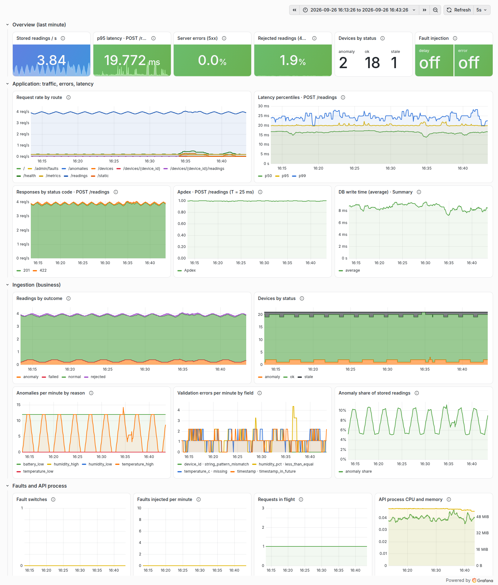

*Fig. B1: the whole dashboard.* The stat row sums up the service's last minute:
- 3.84 readings stored per second, p95 19.8 ms, 0 % server errors and 1.9 % of readings rejected.
- 2 devices in anomaly, 18 ok and 1 stale.
- Both faults off.

Every line is flat or regularly periodic. That's the baseline Part E will be compared against.

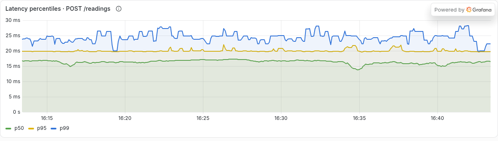

*Fig. B2: latency percentiles.* p50 stays at about 16–17 ms.
- **p95 sits almost exactly on 20 ms.** The 95th percentile falls in the 15–20 ms bucket, just below its upper edge, and `histogram_quantile` interpolates inside that bucket. So the line is flat, with small bumps when a few slower requests push it into the next bucket.
- **p99 steps between 23 and 28 ms.** In a one-minute window it's decided by only the 2–3 slowest of about 240 requests, so a single slow request moves it.

The gap between p50 and p99 is only about 8 ms: under normal load there's no long tail. B.4 checks these estimates against the real durations in the logs.

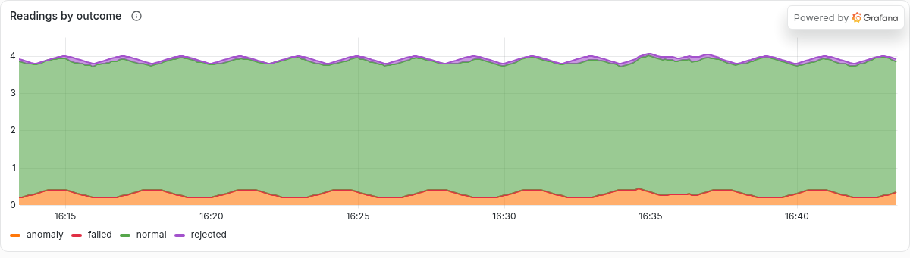

*Fig. B3: readings by outcome (stacked).* The total ripples between about 3.8 and 4.0 readings/s with a **2-minute period**. That's dev-020 going silent for 60 s out of every 120 s, which removes 0.2 readings/s. The orange anomaly band steps between **0.2/s and 0.4/s**:
- dev-018's battery is always low, which accounts for one reading every 5 s, or 0.2/s.
- dev-017 adds another 0.2/s while it's above 35 °C.

The thin purple `rejected` band (about 0.06/s) is dev-019. `failed` is 0.

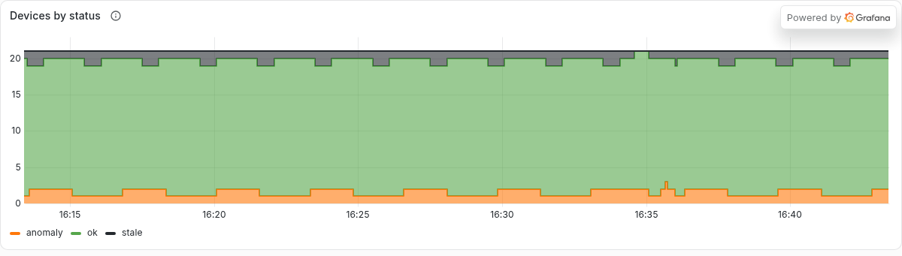

*Fig. B4: devices by status (stacked).*
- **Orange (anomaly)** alternates between 1 and 2 as dev-017 heats up and resets, about every 3.3 minutes.
- **Grey (stale)** has a constant 1: a test device, `dev-100`, left over from my manual testing and silent since. dev-020 adds a notch every 2 minutes, each lasting about 30 s: silent for 60 s minus the 30 s grace period.
- **At 16:35 the grey band drops to 0 and orange jumps to 3.** That's when I sent "Too hot" readings as `dev-100`: it was briefly fresh (so not stale) and anomalous.

This matches what `GET /devices` reported at the same time, because both use the same `compute_status()`.

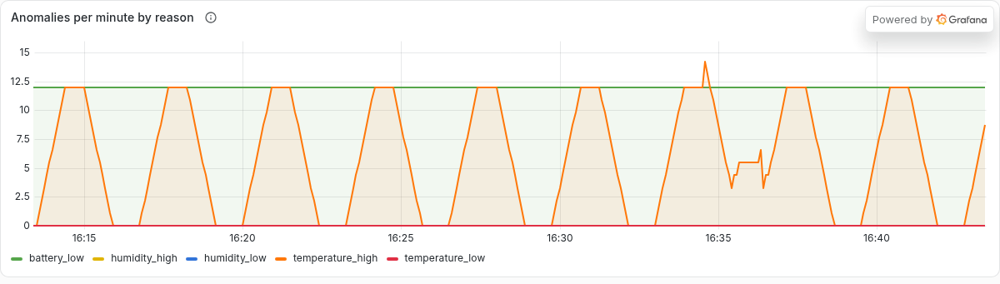

*Fig. B5: anomalies per minute by reason.*
- **`battery_low` is flat at exactly 12/min.** That's every reading from dev-018: one every 5 s.
- **`temperature_high` makes trapezoids about every 3.3 minutes.** Each plateau is 12/min, which means every dev-017 reading is flagged while it's above 35 °C. The sloped sides are the 1-minute `increase()` window sliding over the start and end of each hot phase.
- The bump to 14 at 16:34 is my "Too hot" test readings.
- The other three reasons stay at 0, because no simulated device goes below 10 °C or outside 20–80 % humidity.

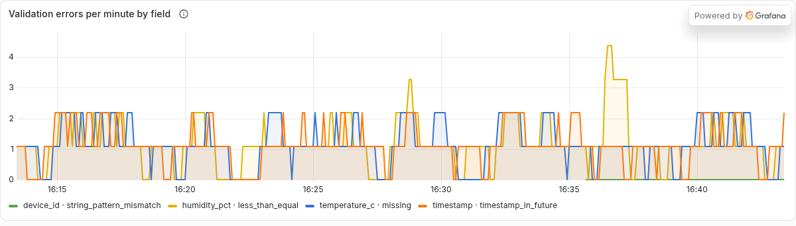

*Fig. B6: validation errors per minute, by field and reason.* These are **why** readings were rejected. dev-019's three kinds of bad data interleave at about 1 per minute each: `humidity_pct · less_than_equal`, `temperature_c · missing` and `timestamp · timestamp_in_future`. The values come out as 1.09 rather than whole numbers because `increase()` extrapolates to the edges of the window.

My own tests show up too:
- The `humidity_pct` spike to 4 at 16:36 is my "Impossible humidity" readings.
- A new `device_id · string_pattern_mismatch` series appears at 16:35, from a reading I sent with a malformed ID.

An operator can see *which* integration is sending bad data, not just that some requests failed.

### B.4 Percentiles and time window

`histogram_quantile(0.95, sum by (le) (rate(..._bucket[1m])))` means *"95 % of `POST /readings` requests in the last minute finished within this time."* Each point covers the **minute before it**, in a sliding window. With a 5 s scrape that's 12 samples, and about 240 requests.

That window is short enough to show a fault within a minute, and long enough that p95 rests on about 12 requests above it. p99 rests on only 2–3, which is why it's noisier in Fig. B2.

The Python Summary has no quantiles, so percentiles come from the histogram, and the Summary is shown as a mean.

**I checked the estimate against the truth.** A script calculated exact percentiles from the access log's `duration_ms` for the same 60 s window, and compared them with `histogram_quantile` evaluated at the same moment:

| | exact (logs) | first buckets (…10, 25, 50 ms) | finer buckets (…10, 15, 20, 25, 30, 40, 50, 75 ms) |
|---|---|---|---|
| p95 | 20.9 / 18.9 ms | 24.6 ms (+18 %) | 19.9 ms (+5 %) |
| p99 | 25.4 / 24.9 ms | **44.3 ms (+74 %)** | 23.8 ms (−4 %) |

(The two runs were a few minutes apart, so each estimate is compared with its own exact value.)

The bucket *counts* matched the logs to within 0.2 %. The error came from `histogram_quantile` interpolating linearly inside a wide bucket. Adding bounds where the traffic actually sits fixed it, at a cost of 5 extra series per route.

**A trap I hit:** right after a restart, `rate(...[1m])` read 0.56/s while the true rate was 3.9/s. `rate()` divides by the whole window, so it only settles once the window holds a full minute of data. That's why each experiment stage needs to run for longer than the window.

### B.5 Self-explored metric: Apdex from the latency histogram

Apdex scores user satisfaction from 0 to 1 as `(satisfied + tolerating/2) / total`:
- Satisfied: at or under T = 25 ms, about the normal p95.
- Tolerating: at or under 4T = 100 ms.

Histogram buckets are cumulative, so both counts are existing series and no new code is needed:
```promql
( sum(rate(sensor_http_request_duration_seconds_bucket{route="/readings",method="POST",le="0.025"}[1m]))
+ sum(rate(sensor_http_request_duration_seconds_bucket{route="/readings",method="POST",le="0.1"}[1m])) ) / 2
/ sum(rate(sensor_http_request_duration_seconds_count{route="/readings",method="POST"}[1m]))
```
In Fig. B1 it sits flat at about **0.98**. Unlike p95, which ignores the slowest 5 % of requests, Apdex counts every one of them. So it drops as soon as a fraction of requests slow down, even while p50 stays flat.

A second exploration is `sensor_devices` (Fig. B4), which is computed by a collector at scrape time. A device becomes stale by *not* sending anything, so there's no event to count.

### B.6 Node Exporter

**Machine measured:** my laptop, `node_uname_info{nodename="muhammad-affan-Latitude-5400", release="7.0.0-34-generic"}`:
- Dell Latitude 5400
- Intel Core i5-8365U (8 threads)
- 7.6 GiB RAM, NVMe disk
- Ubuntu 24.04.5

It runs directly on the hardware with no VM (`systemd-detect-virt` → `none`), because Docker Engine is installed natively. So these are the physical machine's numbers.

`prom/node-exporter:v1.12.1` runs with `network_mode: host`, `pid: host` and `/` mounted read-only, so it sees the host rather than its own container. Prometheus reaches it at `host.docker.internal:9100`.

Its values matched the host's own tools:

| What | Node Exporter | Host tool |
|---|---|---|
| CPUs | 8 | `nproc`: 8 |
| Memory | 7.57 GiB, 56.3 % used | `free`: 56.0 % |
| Load average (1 min) | 0.78 | `/proc/loadavg`: 0.78 |

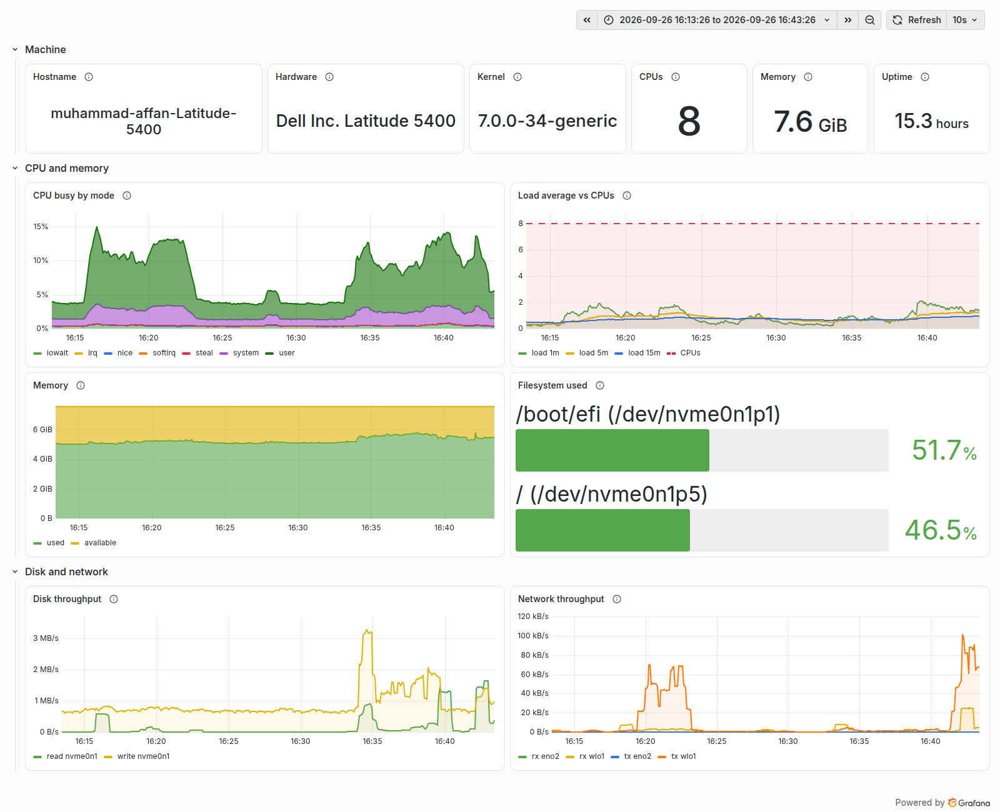

*Fig. B7: the host over the same 30 minutes.*
- **The stack is light.**
  - CPU busy stays at 3–5 % with short bursts to about 15 %. Those bursts come from other things running on the laptop (browser, editor, the screenshot tool); the API itself uses only about 0.04 cores.
  - The 1-minute load average stays below 2, far under the dashed line for the 8 CPUs.
- **Memory:** about 5.2 of 7.6 GiB is in use, most of it by desktop apps rather than the stack (~350 MB, measured with `docker stats`). That leaves about 2.3 GiB for Part C's Elasticsearch.
- **Disk:** there's a steady ~1 MB/s of writes, which includes the SQLite commits and Prometheus's write-ahead log. `/` is 46.5 % full.
- **Network:** Wi-Fi (`wlo1`) carries the laptop's traffic. The wired `eno2` is idle.

---

## C. Logs

The pipeline: the app writes JSON to stdout → Docker saves it → Filebeat reads and parses it → Elasticsearch stores it → Kibana searches it. Everything is configured from files in `monitoring/` (`filebeat/`, `elasticsearch/`, `kibana/`, `logs-setup.sh`), with nothing clicked together. The images are Elastic 9.5.3; Logstash isn't used.

### C.1 What is logged, why, and where

`app/logging_setup.py` writes **one JSON object per line** to stdout. Every line has `timestamp` (UTC), `level`, `service`, `logger`, `event` (a fixed machine name), `message` (a human sentence) and `request_id`. The middleware takes the request ID from the client's `X-Request-ID` header, or generates one. It's stored in a context variable, so every line written while handling a request carries it.

| Event | Level | Extra fields | Emitted in | Why |
|---|---|---|---|---|
| `http_request` | INFO (ERROR if 5xx) | method, path (route template), status_code, duration_ms | `app/middleware.py:96` | one line per request: traffic, latency, failures |
| `reading_stored` · `device_registered` | INFO | device_id, reading_id, is_anomaly | `app/main.py:165`, `:161` | the trail of each accepted reading |
| `anomaly_detected` | WARNING | device_id, reading_id, anomaly_reasons, the 3 values | `app/main.py:176` | which device and which reading triggered an alarm |
| `reading_rejected` | WARNING | errors = [{field, type}], device_id if valid | `app/main.py:90` | why a reading was rejected, **without the submitted values** |
| `fault_config_changed` · `fault_injected` | WARNING / ERROR | config, fault, delay_ms | `app/main.py:238`, `app/faults.py:58` | marks when an experiment was running |
| `unhandled_exception` | ERROR | error, stack | `app/middleware.py:62` | crashes, with a traceback |
| `startup` · `sim_startup` · `sim_summary` · `sim_send_failed` | INFO / WARNING | config, stats, status_code, fault | `app/main.py:61`, `simulator/simulate.py:126–155` | restarts, and the client's view of failures |

**Not logged:** request bodies, headers (`Authorization`, cookies), query strings, client IPs, and the values of rejected fields. Only the fields on the whitelist in `EXTRA_FIELDS` (`app/logging_setup.py:15`) are ever emitted, so anything else is dropped before a line is written. C.6 tests this through the whole pipeline.

### C.2 How Filebeat collects logs and turns them into fields

Docker's `json-file` driver wraps each stdout line as `{"log":"<our JSON>\n","stream":"stdout","time":"…"}` and writes it to `/var/lib/docker/containers/<id>/<id>-json.log`. Filebeat (`monitoring/filebeat/filebeat.yml`) mounts that directory and the Docker socket **read-only**:

1. **Autodiscover (docker)** starts a `filestream` input only for containers named `esd_hw1-(api|simulator)-N`. A re-created container is followed automatically; the new container's lines appeared within about 6 s.
2. **The `container` parser** unwraps Docker's envelope: `message` = our JSON line, `stream` = stdout.
3. **`copy_fields`** keeps the untouched line in `log.original`.
4. **`decode_json_fields`** parses `message` into top-level fields (`event`, `request_id`, `duration_ms`, …). Our human sentence becomes `message`.
5. **`timestamp`** sets `@timestamp` from *our* `timestamp`, so events are ordered by when the app wrote them, not when Filebeat read them.
6. **`drop_fields`** removes Beat bookkeeping and Docker labels. The labels contained the host path `/home/<user>/…`, i.e. my name, which I found in the first stored documents (C.6).
7. The output is the **data stream `sensor-logs`**. Its index template (`monitoring/elasticsearch/index-template.json`, installed by the one-shot `logs-setup` service before Filebeat starts) maps 29 fields with explicit types: `keyword` for `event`, `level`, `request_id`, `device_id`; numbers for `duration_ms`, `status_code`, `temperature_c`. It uses `dynamic: false`, so an unexpected field is kept in the document but never becomes a new searchable field.

No text parsing is needed: the app writes JSON, and Filebeat decodes JSON.

### C.3 Where logs live, what survives restarts, and when they're deleted

| Stage | Where | Survives `restart` | Survives container re-creation / `down` | Deleted when |
|---|---|---|---|---|
| Docker's log file | `/var/lib/docker/containers/<id>/*-json.log` | yes | **no**, it belongs to the container | rotation at 3 × 10 MB (`x-app-logging`), or when the container is removed |
| Filebeat's read position | volume `filebeat-data` (registry) | yes | yes (not `down -v`) | — |
| Indexed documents | volume `es-data`, data stream `sensor-logs` → backing indices `.ds-sensor-logs-<date>-00000N` | yes | yes (not `down -v`) | **ILM `sensor-logs-policy`: a new backing index every 10 min, each deleted 1 h after its rollover** |

All of these were tested (docs/BUILD_LOG.md, stage C7):
- After `up --force-recreate api`, `docker compose logs` no longer contained request `c5-demo-1` (3 → 0 lines), but Elasticsearch still returned all 3 documents.
- Restarting Filebeat created no duplicates.
- A reading logged while Filebeat was stopped for 20 s appeared as soon as it started again.

Retention is deliberately short so it can be demonstrated:
- `.ds-sensor-logs-2026.09.26-000001` was created at 17:25:43 and rolled over at **17:36:20** (10 min + the 1-minute ILM check interval).
- `-000002` rolled over at 17:46:23.
- **`-000001` was deleted at 18:38:29**: ILM moved it to the delete phase at 18:38:09, 1.03 h after its rollover, and it was gone 20 s later. It lived 1 h 13 min in total. Its documents went with it: searching `request_id : "c5-demo-1"` (C.5) now returns 0, and the screenshots below are that example's only record.

So logs are kept for about 1 h 10 min. Production would use days (e.g. roll over daily, delete after 7 d), which is a one-line change in `ilm-policy.json`.

### C.4 Searching in Kibana

Kibana (http://localhost:5601, bound to localhost only) opens Discover on the provisioned data view **Sensor logs** (`sensor-logs`, time field `@timestamp`). The **7 saved searches** in `monitoring/kibana/saved-objects.ndjson` are imported by `logs-setup`:

| Saved search | KQL |
|---|---|
| Errors and warnings | `level : ("ERROR" or "WARNING")` |
| Server errors (5xx) | `event : "http_request" and status_code >= 500` |
| Slow requests (> 100 ms) | `event : "http_request" and duration_ms > 100` |
| Rejected readings (422) | `event : "reading_rejected"` |
| Anomalies | `event : "anomaly_detected"` |
| Fault injection | `event : ("fault_injected" or "fault_config_changed")` |
| Simulator send failures | `service : "simulator" and event : "sim_send_failed"` |

- **To follow one request:** `request_id : "<id>"`. The ID comes from the `X-Request-ID` response header, the dashboard's result box, or the simulator's own log line.
- **To see everything from one device:** `device_id : "dev-019"`.

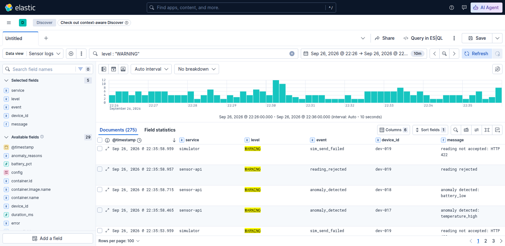

*Searching by severity: `level : "WARNING"` over 10 minutes (22:26–22:36 PKT, 17:26–17:36 UTC) returns **275** lines. Kibana's field aggregations break them down:*
- **177 `anomaly_detected`:** mostly dev-018 (low battery) and dev-017 (overheating).
- **43 `reading_rejected`:** 42 from dev-019's bad data, plus 1 from my privacy test (C.6).
- **55 `sim_send_failed`:** the simulator's side. 42 are the same dev-019 rejections seen from the client, and **13 are `ConnectError`s**.

The histogram is otherwise flat at 2–6 warnings per 10 s. Its peak (12 at 22:30:10) is those `ConnectError`s: that's when I restarted the API (C.3), and the simulator's readings failed to connect for a few seconds. Logs from both services, side by side, tell that story.

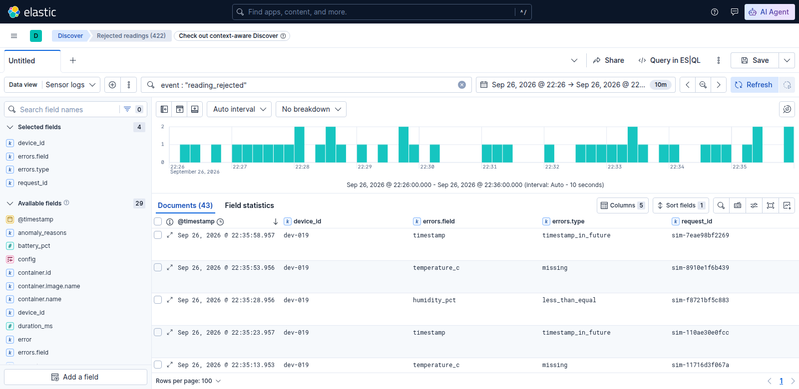

*The saved search **Rejected readings (422)**, with the columns `device_id`, `errors.field`, `errors.type` and `request_id`.* 42 of the 43 rows are dev-019, and the reasons rotate: `timestamp · timestamp_in_future`, `temperature_c · missing`, `humidity_pct · less_than_equal`. The one exception is my own test reading as dev-100. An integrator would see exactly what's wrong with their payloads, and the values they sent are never shown. Each row's `request_id` (`sim-…`) leads to the matching simulator line.

### C.5 Worked example: one log line from the app to a Kibana search

**1. The app writes it**: `anomaly_detected` for `POST /readings` with `X-Request-ID: c5-demo-1` and 41.5 °C:
```json
{"timestamp": "2026-09-26T17:28:33.009Z", "level": "WARNING", "service": "sensor-api", "logger": "app", "event": "anomaly_detected", "message": "anomaly detected: temperature_high", "request_id": "c5-demo-1", "device_id": "dev-100", "reading_id": 116760, "anomaly_reasons": ["temperature_high"], "temperature_c": 41.5, "humidity_pct": 45.0, "battery_pct": 88.0}
```
**2. Docker saves it** in `/var/lib/docker/containers/aff99987…/aff99987…-json.log`:
```json
{"log":"{\"timestamp\": \"2026-09-26T17:28:33.009Z\", … \"battery_pct\": 88.0}\n","stream":"stdout","time":"2026-09-26T17:28:33.01002747Z"}
```
**3. Elasticsearch stores it** in `.ds-sensor-logs-2026.09.26-000001` as a flat document. Every field is separate and typed, and the original line is kept in `log.original` (stored, not indexed):

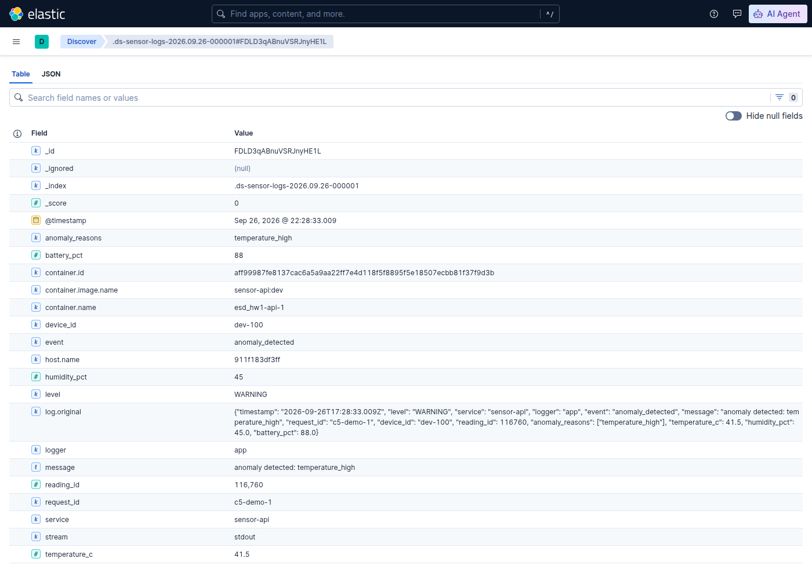

*The stored document, field by field.* Taking the fields in groups:
- **`@timestamp`** (22:28:33.009 PKT) is the app's time, not Docker's (…33.010).
- **Our fields** (`level`, `event`, `request_id`, `device_id`, `anomaly_reasons`, the values) came from `decode_json_fields`.
- **`container.*`** came from autodiscover, and `stream` from the container parser.
- **`log.original`** is step 1 unchanged.
- **Nothing about the host user** remains; the Docker labels were dropped.

**4. Kibana finds it:** `request_id : "c5-demo-1"`

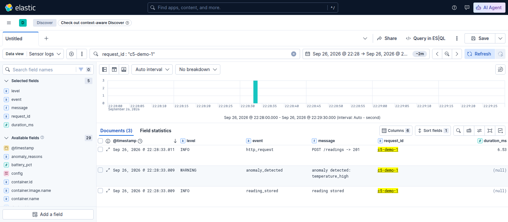

*Searching `request_id : "c5-demo-1"` returns **exactly 3 documents**: every line the service wrote for that one request.* In order:
1. `reading_stored` (INFO)
2. `anomaly_detected` (WARNING)
3. `http_request` `POST /readings -> 201`, with `duration_ms` 6.53

This is the question metrics can't answer: *what happened to this particular request?* Even after the API container was re-created and `docker compose logs` had lost these lines, the same search still found all 3.

### C.6 No secrets or personal data

I sent requests containing fake secrets:
- an `Authorization: Bearer …` header and a `Cookie` header,
- extra body fields `password` and `owner_email`,
- a password in a rejected body,
- a `?token=…` query string.

Then I scanned the `_source` of **all 11,343 stored documents** (including `log.original`) and the raw Docker logs. **Every planted value was found 0 times**, as were the words `Bearer`, `password` and `/home/`.

Two lessons came out of this:
- **The Filebeat processors only copy, parse or drop; none adds data.** The one leak I found came from Filebeat's own Docker metadata (the home path, C.2), and it's now dropped.
- **Elasticsearch's `dynamic: false` is not a privacy control.** A test document with a `password` field wasn't searchable, but it was still stored. Privacy has to be enforced where the log line is written: the app's whitelist.

## D. System design

_Not started._

## E. Experiments

_Not started._

---

## Credits and AI assistance

- Written with the help of Claude Code (Anthropic). I reviewed, ran and verified every command and output recorded here.
- Libraries and tools: FastAPI, Uvicorn, Pydantic, httpx, pytest, prometheus_client, Prometheus, Grafana, Node Exporter, Filebeat, Elasticsearch, Kibana.
